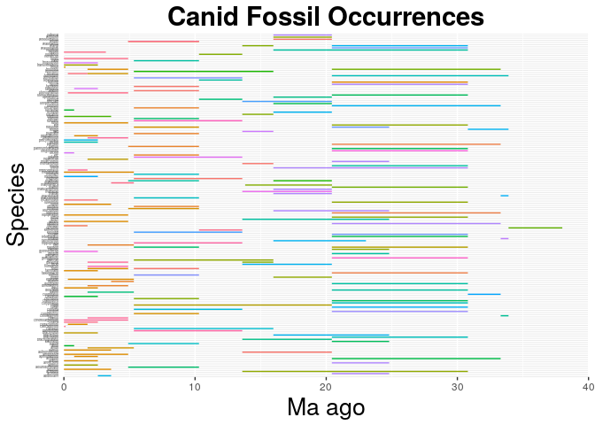
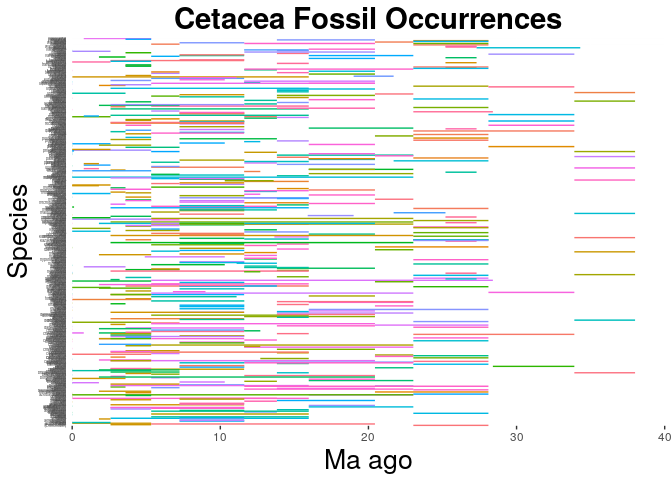

Family Canids:
==============

------------------------------------------------------------------------

  

    #install.packages("paleotree")
    library(ggplot2)
    canids <- read.csv("~/Desktop/eeb-177/homework/canids-ranges.csv", header = F, as.is = T)
    names(canids) <- c("genus", "species", "minage", "maxage")
    head(canids)

    ##         genus          species  minage maxage
    ## 1  Cynodesmus          martini 20.4300 30.800
    ## 2 Cynotherium          sardous  0.0117  3.600
    ## 3  Borophagus              orc 10.3000  5.333
    ## 4   Oxetocyon       cuspidatus 30.8000 33.300
    ## 5       Canis          adustus  0.0000  3.600
    ## 6     Urocyon cinereoargenteus  0.0000  4.900

    canid_occ <- ggplot(canids, aes( species, ymin = maxage, ymax=minage, colour = genus))
    canid_occ <- canid_occ + geom_linerange()+ theme(legend.position="none")+ coord_flip()+  theme(axis.text.y = element_text(size=3))+ theme(axis.ticks.y=element_blank()) + scale_y_continuous(limits=c(0, 40), expand = c(0, 0), breaks=c(0, 10, 20, 30, 40)) + labs(title = "Canid Fossil Occurrences", x = "Species", y = "Ma ago") + theme(plot.title = element_text(hjust = 0.5, size=22, face = "bold"), axis.title =element_text(size=20))

    canid_occ

    ## Warning: Removed 3 rows containing missing values (geom_linerange).

    ggsave(filename = "canid-occ.pdf", plot = canid_occ)

    ## Saving 7 x 5 in image

    ## Warning: Removed 3 rows containing missing values (geom_linerange).

Report for family Canids:
=========================

------------------------------------------------------------------------

1.What taxonomic group is displayed?   Figures are for the group
Canids.

2.How many unique fossil species are contained within it?   I've used
the following command   cat canids-ranges.csv | cut -d "," -f 2 |
sort | uniq | wc -l   Answer: There are 160 unique fossil species.

3.How many unique fossil genera?   I've used the following command
  cat canids-ranges.csv | cut -d "," -f 1 | sort | uniq | wc -l  
Answer: There are 58 uniqe genera.

4.What species has the longest(range)?   Longest fossil range belongs
to Cynarctoides acridens , with the fossil range =
\[17.200000000000003\]

   

Family Cetacea:
===============

------------------------------------------------------------------------

    #install.packages("paleotree")
    library(ggplot2)
    cetacea <- read.csv("~/Desktop/eeb-177/homework/cetacea-ranges.csv", header = F, as.is = T)
    names(cetacea) <- c("genus", "species", "minage", "maxage")
    head(cetacea)

    ##             genus     species  minage maxage
    ## 1      Notiocetus   platensis  0.0117  2.588
    ## 2       Squalodon    dalpiazi 13.8200 20.440
    ## 3 Ferecetotherium    kelloggi 23.0300 28.100
    ## 4    Globicephala    uncidens  1.8060  3.600
    ## 5        Atocetus    iquensis 11.6200 13.820
    ## 6       Notocetus vanbenedeni 15.9700 23.030

    cetacea_occ <- ggplot(cetacea, aes( species, ymin = maxage, ymax=minage, colour = genus))
    cetacea_occ <- cetacea_occ + geom_linerange()+ theme(legend.position="none")+ coord_flip()+  theme(axis.text.y = element_text(size=3))+ theme(axis.ticks.y=element_blank()) + scale_y_continuous(limits=c(0, 40), expand = c(0, 0), breaks=c(0, 10, 20, 30, 40)) + labs(title = "Cetacea Fossil Occurrences", x = "Species", y = "Ma ago") + theme(plot.title = element_text(hjust = 0.5, size=22, face = "bold"), axis.title =element_text(size=20))

    cetacea_occ

    ## Warning: Removed 51 rows containing missing values (geom_linerange).

    ggsave(filename = "cetacea-occ.pdf", plot = cetacea_occ)

    ## Saving 7 x 5 in image

    ## Warning: Removed 51 rows containing missing values (geom_linerange).

Report for family Canids:
=========================

------------------------------------------------------------------------

1.What taxonomic group is displayed?   Figures are for the group
Cetacea.

2.How many unique fossil species are contained within it?   I've used
the following command   cat cetacea-ranges.csv | cut -d "," -f 2 |
sort | uniq | wc -l   Answer: There are 545 unique fossil species.

3.How many unique fossil genera?   I've used the following command
  cat cetacea-ranges.csv | cut -d "," -f 1 | sort | uniq | wc -l  
Answer: There are 354 uniqe genera.

4.What species has the longest(range)?   Longest fossil range belongs
to two species : Longest fossil range belongs to Eubalaena australis ,
with the fossil range = \[23.03\] Longest fossil range belongs to
Megaptera novaeangliae , with the fossil range = \[23.03\]
